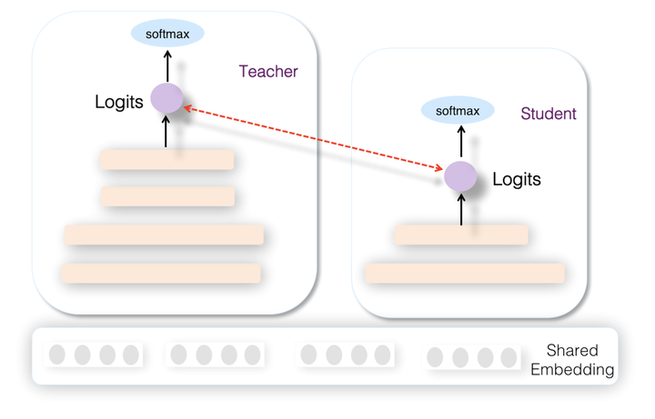

# 深度学习基础知识

[**1. 数据预处理**](#数据预处理)

[**2. 权重初始化**](#权重初始化)

[**3. 正则化**](#正则化)

[**4. 集成**](#集成)

[**5. Dropout**](#dropout)

[**6. Attention机制**](#attention机制)

[**7. 更好的损失函数**](#更好的损失函数)

[**8. fp16与fp32**](#fp16与fp32)

[**9. 知识蒸馏 Teacher&Student**](#知识蒸馏)

[**10. word2vec**](#word2vec)

[**11. transformers**](#transformers)

[**深度学习面试准备网址**](#深度学习面试准备网址)

---

## 数据预处理

（1）**减均值** 
（2）**大小缩放**，统一在\[-1,1]或者\[0,1]区间内的数据更利于模型的处理 
（3）**标准化**，z-score

## 权重初始化

（1）**全零初始化**，不适合深度学习，会打破神经元之间的对称性，将导致收敛速度很慢甚至训练失败 
（2）**随机初始化**，不适合深度学习，比较难把握权重的大小与相关神经元数量的关系，则对应的输出值方差会出现较大的差异，导致收敛速度很慢甚至失败 
（3）**方差校准**，避免了随机初始化方差不稳定的问题 
（4）**Batch Normalization**，批量正则化的出现在一定程度上缓解了初始化问题

## 正则化

（1）**提前终止**，当验证集上的误差不在减小甚至增大时停止训练 
（2）**数据增强**，可以通过噪声、裁剪等方法获取更多数据 
（3）**L2/L1参数正则化**，损失函数加正则项；正则原理：L2/L1是添加一个参数w取0附近的先验；具体看书98页 

## 集成
    
（1）**生成多个模型的方法有多种**
  
  - 对数据进行放回重采样Bagging(Boostrap Aggregating)--从数量为n的原始数据D中分别独立随机抽取n次，由于是放回重采样，
  每次抽取的候选集都是同样的n个数据，这样得到的新数据集用于训练模型。重复这个过程，就会得到多个模型。 
  - Boosting--先针对原始数据训练一个比随机分类器性能要好一点的模型，然后用改分类器对训练数据进行预测， 
  对预测错误的数据进行加权，从而组成一个新的训练集，重新训练即可得到新的模型 
  - 不同的训练数据--比如要对视频进行分类，部分模型用语音数据，部分模型用字幕图像数据 
  - 不同的模型结构--比如有的卷积模型用三层卷积，有的用五层卷积，同样的训练数据也可以出来不同的模型
  
（2）**合并多个模型的方法也有多种**

  - 选择验证集上效果最好的模型 
  - 对多个模型进行投票或取平均值 
  - 对多个模型的预测结果进行加权平均
  
## Dropout

（1）Dropout是深度学习领域比较常见的正则化方法 
（2）训练时dropout，验证或测试时不要dropout

dropout为什么能防止过拟合[本质解释]： 
1. dropout可以使网络稀疏，减少参数之间的相互依赖关系 
2. [本质]每次dropout会得到不同的模型，相当于多模型结果取平均，从而降低方差，防止过拟合 

## Attention机制

Attention的出现就是为了两个目的： 
1. 减小处理高维输入数据的计算负担，通过结构化的选取输入的子集，降低数据维度。 
2. “去伪存真”，让任务处理系统更专注于找到输入数据中显著的与当前输出相关的有用信息，从而提高输出的质量

[深度学习中的注意力机制(2017版) 必看！！！](https://blog.csdn.net/malefactor/article/details/78767781) 

## 更好的损失函数

对于二分类模型，我们总希望模型能够给正样本输出1，负样本输出0，但限于模型的拟合能力等问题，一般来说做不到这一点。而事实上在预测中，我们也是认为大于0.5的就是正样本了，小于0.5的就是负样本。这样就意味着，我们可以“有选择”地更新模型，比如，设定一个阈值为0.6，那么模型对某个正样本的输出大于0.6，我就不根据这个样本来更新模型了，模型对某个负样本的输出小于0.4，我也不根据这个样本来更新模型了，只有在0.4~0.6之间的，才让模型更新，这时候模型会更“集中精力”去关心那些“模凌两可”的样本，从而使得分类效果更好，这跟传统的SVM思想是一致的。 
不仅如此，这样的做法理论上还能防止过拟合，因为它防止了模型专门挑那些容易拟合的样本来“拼命”拟合（使得损失函数下降），怎样才能达到我们上面说的目的呢？很简单，调整损失函数即可，这里主要借鉴了hinge loss和triplet loss的思想。 
[链接](https://www.kexue.fm/archives/4293) 

## fp16与fp32

[fp16与fp32简介与试验-彻底搞清楚fp16](https://www.codenong.com/cs105885714/)

## 知识蒸馏

 

如上图所示，所谓联合训练，指的是在离线训练Student模型的时候，增加复杂Teacher模型来辅助Student，两者同时进行训练，是一种训练过程中的辅导。从网络结构来说，Teacher和Student模型共享底层特征Embedding层，Teacher网络具有层深更深、神经元更多的MLP隐层，而Student则由较少层深及神经元个数的MLP隐层构成，两者的MLP部分参数各自私有。对于所有训练数据，会同时训练Teacher和Student网络，对于Teacher网络来说，就是常规的训练过程，以交叉熵作为Teacher的损失函数。而对于Student网络来说，损失函数由两个部分构成，一个子项是交叉熵，这是常规的损失函数，它促使Student网络去拟合训练数据；另外一个子项则迫使Student输出的Logits去拟合Teacher输出的Logits，所谓蒸馏，就体现在这个损失函数子项，通过这种手段让Teacher网络增强Student网络的模型泛化能力。也即：
 

## word2vec

[word2vec算法 + negative sampling](https://blog.csdn.net/liuweiyuxiang/article/details/94396228) 
[word2vec训练优化之Negative Sampling](https://download.csdn.net/blog/column/11373790/122231548) 
[word2vec分层softmax（被负采样取代，不用看了）]() 

## transformers

[3D视角剖析Attention，图解高维矩阵运算，再也不怕Transformer](https://zhuanlan.zhihu.com/p/441240252) 

---

参考网址：

[DeepLearningBookQA_cn]
(https://github.com/elviswf/DeepLearningBookQA_cn) or (https://nbviewer.jupyter.org/github/laobadao/Deep-Learning-Interview/blob/master/Deep%20Learning%20Interview.ipynb)