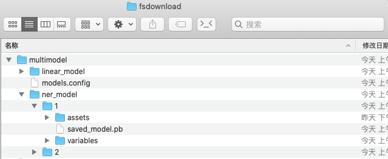

# tf2学习

版本tensorflow2.2.0
[学习github网址](https://github.com/lyhue1991/eat_tensorflow2_in_30_days)<br>

# 目录

 - [**1. 安装**](#安装)
 - [**2. tensorflow2.x基础笔记**](#tf2基础笔记)
 - [**3. 建模**](#建模)


## 安装

`docker pull binzhouchn/tensorflow:2.2.0-cuda10.1-cudnn7`

## tf2基础笔记

[**tf2 basic**](#basic)
 - 1. 自变量转换成tf.float32
 - 2. Tensorflow一般使用梯度磁带tf.GradientTape来记录正向运算过程，然后反播磁带自动得到梯度值
 - 3. 利用梯度磁带和优化器求最小值
 - 4. 取切片数据
 - 5. 矩阵乘法
 - 6. tf2低阶api-张量的结构操作(维度变换、合并分割)
 - 7. 如果调用被@tf.function装饰的函数时输入的参数不是Tensor类型，则每次都会重新创建计算图。因此，一般建议调用@tf.function时应传入Tensor类型
 - 8. 查看模型文件相关信息，红框标出来的输出信息在模型部署和跨平台使用时有可能会用到
 - 9. 数据管道Dataset
 - 10. tf.keras.layers内置了非常丰富的各种功能的模型层
 - 11. 训练模型的3种方法
 - 12. 查看是否有GPU及相关设置

[**mnist_demo**](#mnist_demo)

[**用tf.keras构建自己的网络层**](#用tf_keras构建自己的网络层)

[**保持序列模型和函数模型**](#保持序列模型和函数模型)

[**结构化数据分类(一般csv文件数据特征处理)**](#结构化数据分类)

[**mlp及深度学习常见技巧**](#mlp及深度学习常见技巧)

[**使用低级api训练(非tf.keras)**](#使用低级api训练)

[**GAN**](#gan)

[**Transformer**](#transformer)

[**tensorflow serving模型部署**](#tensorflow_serving)

---

### basic

**1. 自变量转换成tf.float32**
```python
x = tf.cast(x, tf.float32)
```

**2. Tensorflow一般使用梯度磁带tf.GradientTape来记录正向运算过程，然后反播磁带自动得到梯度值**
```python
# 一阶导
x = tf.Variable(0.0,name = "x",dtype = tf.float32)
with tf.GradientTape() as tape:
    y = a*tf.pow(x,2) + b*x + c
tape.gradient(y,x)

# 二阶导
with tf.GradientTape() as tape2:
    with tf.GradientTape() as tape1:   
        y = a*tf.pow(x,2) + b*x + c
    dy_dx = tape1.gradient(y,x)   
dy2_dx2 = tape2.gradient(dy_dx,x)
```

**3. 利用梯度磁带和优化器求最小值**

[自动微分详见](https://github.com/lyhue1991/eat_tensorflow2_in_30_days/blob/master/2-3,%E8%87%AA%E5%8A%A8%E5%BE%AE%E5%88%86%E6%9C%BA%E5%88%B6.md)<br>
```python
# 求f(x) = a*x**2 + b*x + c的最小值
# 使用optimizer.apply_gradients

x = tf.Variable(0.0,name = "x",dtype = tf.float32)
a = tf.constant(1.0)
b = tf.constant(-2.0)
c = tf.constant(1.0)

optimizer = tf.keras.optimizers.SGD(learning_rate=0.01)
for _ in range(1000):
    with tf.GradientTape() as tape:
        y = a*tf.pow(x,2) + b*x + c
    dy_dx = tape.gradient(y,x)
    optimizer.apply_gradients(grads_and_vars=[(dy_dx,x)])
    
tf.print("y =",y,"; x =",x)
```

**4. 取切片数据**
```python
x = tf.Variable([1,2,3,4,5,6])
slice_idx = tf.constant([0,3,5])
tf.gather(x, slice_idx)
#得到<tf.Tensor: shape=(3,), dtype=int32, numpy=array([1, 4, 6], dtype=int32)>
```

**5. 矩阵乘法**

用tf.matmul或者@

**6. tf2低阶api - 张量的结构操作**

 - 6.1 维度变换
 
 tf.reshape 可以改变张量的形状<br>
 tf.squeeze 可以减少维度<br>
 tf.expand_dims 可以增加维度<br>
 tf.transpose 可以交换维度,比如tf.transpose(x,perm=[0,2,1])<br>
 
 - 6.2 合并分割
 
 4.1 tf.concat和tf.stack有略微的区别，tf.concat是连接，不会增加维度，而tf.stack是堆叠，会增加维度<br>
 4.2 tf.split是tf.concat的逆运算，可以指定分割份数平均分割，也可以通过指定每份的记录数量进行分割。```tf.split(c,3,axis = 0)  #指定分割份数，平均分割```
 

[链接，和numpy很类似](https://github.com/lyhue1991/eat_tensorflow2_in_30_days/blob/master/4-1,%E5%BC%A0%E9%87%8F%E7%9A%84%E7%BB%93%E6%9E%84%E6%93%8D%E4%BD%9C.md)

**7. 如果调用被@tf.function装饰的函数时输入的参数不是Tensor类型，则每次都会重新创建计算图。因此，一般建议调用@tf.function时应传入Tensor类型**

**8. 查看模型文件相关信息，红框标出来的输出信息在模型部署和跨平台使用时有可能会用到**

```shell
!saved_model_cli show --dir ./data/demo/1 --all
```


**9. 数据管道Dataset**

[不同方法构建数据管道及提升管道性能](https://github.com/lyhue1991/eat_tensorflow2_in_30_days/blob/master/5-1,%E6%95%B0%E6%8D%AE%E7%AE%A1%E9%81%93Dataset.md)<br>

/*构建*/

 - 1,从Numpy array构建数据管道
 - 2,从 Pandas DataFrame构建数据管道
 - 3,从Python generator构建数据管道
 - 4,从csv文件构建数据管道
 - 5,从文本文件构建数据管道
 - 6,从文件路径构建数据管道
 - 7,从tfrecords文件构建数据管道

/*加速*/

 - 1，使用 prefetch 方法让数据准备和参数迭代两个过程相互并行
 - 2，使用 interleave 方法可以让数据读取过程多进程执行,并将不同来源数据夹在一起
 - 3，使用 map 时设置num_parallel_calls 让数据转换过程多进行执行
 - 4，使用 cache 方法让数据在第一个epoch后缓存到内存中，仅限于数据集不大情形
 - 5，使用 map转换时，先batch, 然后采用向量化的转换方法对每个batch进行转换

**10. tf.keras.layers内置了非常丰富的各种功能的模型层**

 - layers.Dense
 - layers.Flatten
 - layers.Input
 - layers.DenseFeature
 - layers.Dropout
 - layers.Conv2D
 - layers.MaxPooling2D
 - layers.Conv1D
 - layers.Embedding
 - layers.GRU
 - layers.LSTM
 - layers.Bidirectional
 
如果这些内置模型层不能够满足需求，我们也可以通过编写tf.keras.Lambda匿名模型层或继承tf.keras.layers.Layer基类构建自定义的模型层。

其中tf.keras.Lambda匿名模型层只适用于构造没有学习参数的模型层。

**11. 训练模型的3种方法**

[6-2,训练模型的3种方法](https://github.com/lyhue1991/eat_tensorflow2_in_30_days/blob/master/6-2,%E8%AE%AD%E7%BB%83%E6%A8%A1%E5%9E%8B%E7%9A%843%E7%A7%8D%E6%96%B9%E6%B3%95.md)<br>

**12. 查看是否有GPU及相关设置**

```python
gpus = tf.config.list_physical_devices("GPU")

if gpus:
    gpu0 = gpus[0] #如果有多个GPU，仅使用第0个GPU
    tf.config.experimental.set_memory_growth(gpu0, True) #设置GPU显存用量按需使用
    # 或者也可以设置GPU显存为固定使用量(例如：4G)
    #tf.config.experimental.set_virtual_device_configuration(gpu0,
    #    [tf.config.experimental.VirtualDeviceConfiguration(memory_limit=4096)]) 
    tf.config.set_visible_devices([gpu0],"GPU")
```

使用多GPU训练模型，待补充<br>


### mnist_demo

见代码mnist_demo.py

### 用tf_keras构建自己的网络层

见代码myLayer.py

### 保持序列模型和函数模型

1.1 保存模型参数（推荐）
```python
# 保存
model.save_weights('my_model_weights', save_format='tf')
# 读取
new_model = get_model() # 之前设计好的模型结构
new_model.compile(loss='sparse_categorical_crossentropy',
                  optimizer=keras.optimizers.RMSprop())
new_model.load_weights('my_model_weights')
```

1.2 保持全模型(子类模型的结构无法保存和序列化，只能保持参数)<br>
可以对整个模型进行保存，其保持的内容包括：<br>

 - 该模型的架构
 - 模型的权重（在训练期间学到的）
 - 模型的训练配置（你传递给编译的），如果有的话
 - 优化器及其状态（如果有的话）（这使您可以从中断的地方重新启动训练）
 
```python
import numpy as np
model.save('the_save_model.h5')
new_model = keras.models.load_model('the_save_model.h5')
new_prediction = new_model.predict(x_test)
np.testing.assert_allclose(predictions, new_prediction, atol=1e-6) # 预测结果一样
```

### 结构化数据分类

[分类](https://blog.csdn.net/qq_31456593/article/details/88777343)<br>
[回归](https://blog.csdn.net/qq_31456593/article/details/88778647)<br>

见代码5.csv_binary_classify.py

### mlp及深度学习常见技巧

[以mlp为基础模型，然后介绍一些深度学习常见技巧， 如：
权重初始化， 激活函数， 优化器， 批规范化， dropout，模型集成](https://blog.csdn.net/qq_31456593/article/details/88915982)

### 使用低级api训练

使用Tensor， Variable和GradientTape这些简单的要是，就可以构建一个简单的模型。步骤如下：

[链接](https://blog.csdn.net/qq_31456593/article/details/95040964)

见代码6.low_api_demo.py

### gan

[链接](https://blog.csdn.net/qq_31456593/article/details/88991068)

见代码files/002-DCGAN.ipynb

### transformer

[这篇讲的确实详细非常好](https://blog.csdn.net/qq_31456593/article/details/89923913)<br>

已讲网页保存至files，还有001-Transformer.ipynb也在files中

### tensorflow_serving

[使用tensorflow-serving部署模型](https://github.com/lyhue1991/eat_tensorflow2_in_30_days/blob/master/6-6%2C%E4%BD%BF%E7%94%A8tensorflow-serving%E9%83%A8%E7%BD%B2%E6%A8%A1%E5%9E%8B.md)<br>

保存：linear_model/1/下有三个文件；并启动服务

```shell
# docker pull tensorflow/serving
# cd到linear_model文件夹的上一层目录，然后运行如下命令
docker run -t --rm -p 8501:8501 \
    -v $PWD/linear_model:/models/linear_model\
    -e MODEL_NAME=linear_model \
    tensorflow/serving & >server.log 2>&1
```

shell调用<br>
```shell
curl -d '{"instances": [[1.0, 2.0], [5.0,7.0]]}' -X POST http://localhost:8501/v1/models/linear_model:predict
```
python调用<br>
```python
import json,requests
data = json.dumps({"signature_name": "serving_default", "instances": [[1.0, 2.0], [5.0,7.0]]})
headers = {"content-type": "application/json"}
json_response = requests.post('http://localhost:8501/v1/models/linear_model:predict', data=data, headers=headers)
predictions = json.loads(json_response.text)["predictions"]
print(predictions)
```

**15. tf-serving多模型部署**<br>

15.1 模型放置的目录结构如下：<br>


其中models.config文件写法如下：
```shell
model_config_list: {
  config: {
    name: "ner_model",
    base_path: "/models/multimodel/ner_model/",
    model_platform: "tensorflow"
  },
  config: {
    name: "linear_model",
    base_path: "/models/multimodel/linear_model/",
    model_platform: "tensorflow"
  }
}
```
15.2 启动docker<br>
```shell
# cd到multimodel文件夹的上一层目录，然后运行如下命令
docker run -t --rm -p 8501:8501 -v $PWD/multimodel:/models/multimodel tensorflow/serving --model_config_file=/models/multimodel/models.config --model_config_file_poll_wait_seconds=60 & >server.log 2>&1
```

15.3 调用方法和之前一样，调用不同的模型只要把:predict前面的模型换成想要用的模型名即可


## 建模

[文本数据建模流程范例](https://github.com/lyhue1991/eat_tensorflow2_in_30_days/blob/master/1-3,%E6%96%87%E6%9C%AC%E6%95%B0%E6%8D%AE%E5%BB%BA%E6%A8%A1%E6%B5%81%E7%A8%8B%E8%8C%83%E4%BE%8B.md)<br>


## 注

[使用spark-scala调用tensorflow2.0训练好的模型](https://blog.csdn.net/zimiao552147572/article/details/105330740)<br>